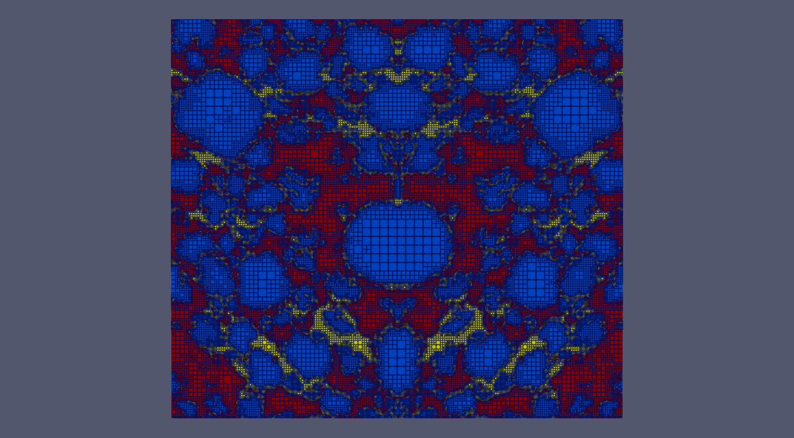
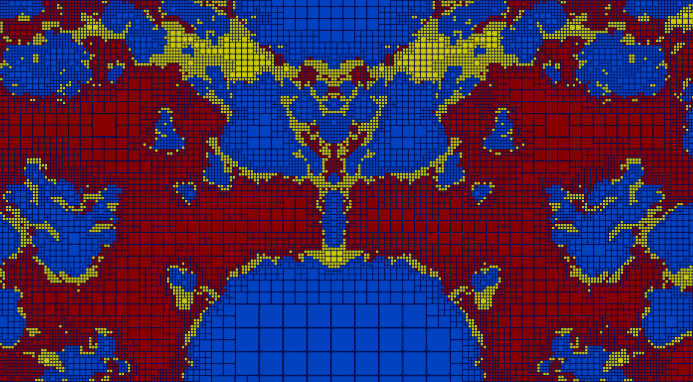

# About this repository

Demo code to show how to use the AMR software library
[p4est](https://github.com/cburstedde/p4est) to create a
mesh from a `tiff` image. The motivation is that the image
corresponds to a certain material composed of various phases.
In addition, the image defines a fine uniform mesh in order to
depict all these phases and the goal is to coarsen that mesh
in the regions where the phases do not change and keep it
fine between phase transitions / boundaries.

## Compilation

### Prerequisites

- [p4est](https://github.com/cburstedde/p4est)
- [libTIFF](http://www.libtiff.org/)

Assuming that both libraries are installed, in particular the `libTIFF` is on your `PATH`.
We provide a minimal Cmake module to find and link against `p4est`, you should define the variable
`P4EST_ROOT` pointing to a `p4est` installation.  Compilation follows the standard `cmake` workflow:

```bash

mkdir /path/to/build_dir
cd /path/to/build_dir
cmake -S /path/to/this/repository -DP4EST_ROOT=/path/to/p4est/install/dir
make

```

## Usage

Successful compilation yields the  executable `/build_dir/P4EST_DEMO` which takes
as argument the`.tif` image to build the mesh from.

### Example



